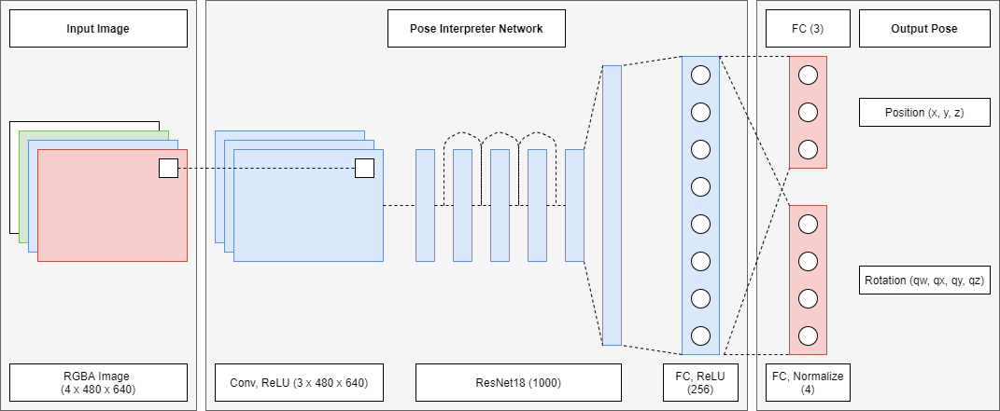
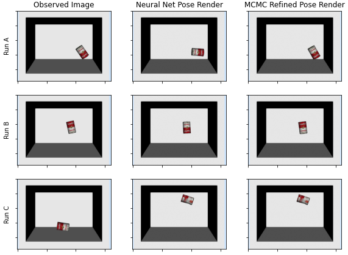

# Pose Estimation of the YCB Soup Can in Simulated Scenes as Integrated Discriminative-Generative Inverse Graphics

## William Chen

This is my code for 6.804J/9.66J - Computational Cognitive Science, a course at MIT taught by Dr. Josh Tenenbaum in Fall 2020. The project explores how physics and graphics simulation engines and stochastic Markov chain Monte Carlo search algorithms can be used to improve upon visual pose estimates outputted by a convolutional neural network. The [full paper](9_66_Final_Project_Write_up.pdf) also in the above repository.

## Contents
1. [Objective](#objective)
0. [The Pose Interpreter Network](#the-pose-interpreter-network)
0. [Heuristic Markov Chain Monte Carlo Search](#heuristic-markov-chain-monte-carlo-search)

## Objective
This project was completed in the [Drake](https://drake.mit.edu/) simulation environment. A mesh model of the [YCB](https://www.ycbbenchmarks.com/) soup can is spawned inside a bin. The goal of the project is to design a system that integrates a discriminative model (a neural network) and a generative model (heuristic MCMC search) to compute the pose of the can with just an image of the scene from above.

## The Pose Interpreter Network
First, the image is fed into a neural network that outputs a rough pose estimate to be refined. The network chosen is based off of the pose interpreter presented in [\[Wu, et al., 2018\]](https://arxiv.org/abs/1808.01099). Said network structure extends the [ResNet18](https://arxiv.org/abs/1512.03385) architecture to output the position of the soup can. I generated synthetic training and validation data using `DataGeneration.ipynb`, then used PyTorch's Adam optimizer for learning. The training code is all in `PoseInterpreterNetwork.ipynb`. This is the discriminative subsystem.

## Heuristic Markov Chain Monte Carlo Search
To improve upon the above results, I used a version of the famous [Metropolis-Hastings algorithm](http://www.mit.edu/~ilkery/papers/MetropolisHastingsSampling.pdf) to search for scenes that are visually similar to the observed one (as visually similar scenes should intuitively have the can in similar poses). This subsystem uses a separate Drake simulation environment to internally render and "imagine" the can in a variety of different poses similar to the initial estimate from the pose interpreter network. Whichever imagined scene is visually most similar to the observed scene ends up being chosen as the final refined pose estimate. This is the generative subsystem. The full pipeline integrating the two subsystems is in `InverseGraphicsv2.ipynb`.

